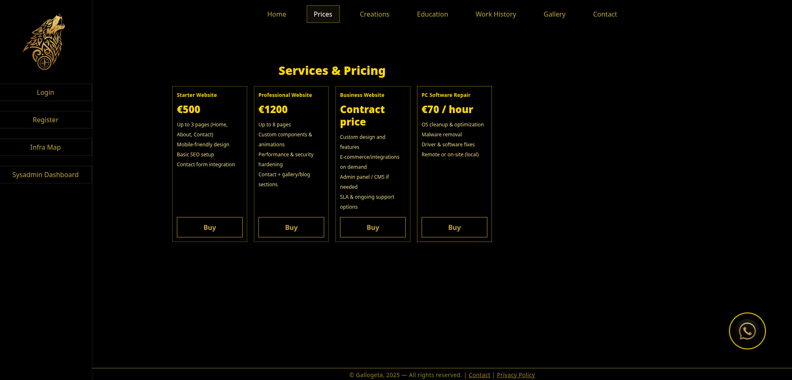

🎮 Personal Homepage & Retro Arcade


A modern full-stack web application featuring a personal website with an integrated retro gaming arcade. Built with FastAPI, React, and EmulatorJS.

FastAPI React 🏗️ Architecture

```
┌─────────────────────────────────────────────────────────┐
│                    Nginx Reverse Proxy                  │
│                   (Port 80/443 - SSL)                   │
└────────────────────┬────────────────────────────────────┘
                     │
        ┌────────────┴────────────┐
        │                         │
        ▼                         ▼
┌──────────────┐          ┌──────────────┐
│   Frontend   │          │   Backend    │
│  React+Vite  │◄────────►│   FastAPI    │
│  Port 3000   │   API    │  Port 8000   │
└──────────────┘  Calls   └──────┬───────┘
        │                        │
        │                        ▼
        │                ┌──────────────┐
        │                │   SQLite DB  │
        │                │  users/pages │
        │                └──────────────┘
        │
        ▼
┌──────────────────┐      ┌──────────────┐
│  EmulatorJS      │      │   ROM Files  │
│  Retro Gaming    │◄─────│  NES/GBA/etc │
└──────────────────┘      └──────────────┘
```

---

## 🙏 Acknowledgments

- [FastAPI](https://fastapi.tiangolo.com/) - Modern Python web framework
- [React](https://reactjs.org/) - Frontend library
- [EmulatorJS](https://github.com/EmulatorJS/EmulatorJS) - Retro game emulation
- [Vite](https://vitejs.dev/) - Fast frontend build tool
- [Docker](https://www.docker.com/) - Containerization platform

---

## 📸 Screenshots

### Desktop View



---

**Built with ❤️ by retro gaming enthusiasts**

*Disclaimer: This project is for educational purposes. Ensure you own or have the right to use any ROM files. In screenshots they are only names and placehoslders, in actuality, I do not have those ROMs.

---

## 🎯 What is this?

This is a **full-stack personal homepage** with a unique twist: an integrated **retro gaming arcade**! Users can register, browse your personal content, and play classic video games right in their browser. Perfect for showcasing your web development skills while sharing your love for retro gaming.

**Tech Stack:** FastAPI (Python) + React (Vite) + SQLite + EmulatorJS + Docker + Nginx

## ✨ Features

### 🌐 Personal Website
- **Dynamic Content Management** - Edit pages through admin panel
- **User Authentication** - Secure JWT-based auth with role-based access
- **User Management** - Admin dashboard for managing users and permissions
- **System Monitoring** - Real-time visitor tracking and system metrics
- **Responsive Design** - Mobile-first, works on all devices

### 🎮 Retro Gaming Arcade
- **Multi-Platform Emulation** - Play NES, SNES, GBA, GB, N64, and more
- **Members-Only Access** - Authentication required to play games
- **Mobile Optimized** - Touch controls, landscape mode support, fullscreen
- **Auto-Save States** - EmulatorJS handles save states automatically
- **Game Library** - Currently featuring 24 NES games and 10 GBA games

### 🔒 Security & Features


- **3-Tier Role System** - Admin, Moderator, and User roles
- **Optional CAPTCHA** - Cloudflare Turnstile or hCaptcha support
- **Email Integration** - User registration with email verification
- **SQLite Database** - Lightweight and portable
- **Docker Ready** - Full containerization with docker-compose
- **Nginx Reverse Proxy** - Production-ready with SSL support
- **Perma BAN** - PERMA BAN TO ANYONE WHO TRIES TO SCAN OR GET .env file.

---

## 🚀 Quick Start

### Prerequisites
- Docker & Docker Compose (recommended)
- OR: Python 3.9+, Node.js 16+, and SQLite

### Using Docker (Recommended)

```bash
# Clone the repository
git clone https://github.com/yourusername/Homepage.git
cd Homepage

# Start all services
docker-compose up -d

# Access at http://localhost
```

### Local Development

**Backend:**
```bash
cd backend
python3 -m venv venv
source venv/bin/activate  # On Windows: venv\Scripts\activate
pip install -r requirements.txt
uvicorn main:app --reload --host 0.0.0.0 --port 8000
```

**Frontend:**
```bash
cd frontend
npm install
npm run dev
# Access at http://localhost:3000
```

---

## 📁 Project Structure

```
Homepage/
├── backend/              # FastAPI backend
│   ├── main.py          # API routes and application
│   ├── data/            # SQLite database
│   ├── SNES/            # NES/SNES ROM storage
│   └── GBA/             # GBA ROM storage
├── frontend/            # React frontend
│   ├── src/             # React components
│   └── public/          # Static assets & arcade
│       ├── arcade.html  # Retro arcade page
│       └── emulatorjs/  # EmulatorJS library
├── nginx/               # Reverse proxy config
├── docker-compose.yml   # Docker orchestration
└── start-local-dev.sh   # Local dev helper script
```

---

## ⚙️ Configuration

### Backend Environment Variables

Create `backend/.env`:

```bash
# Security
SECRET_KEY=your-super-secret-key-change-this
DATABASE_URL=sqlite:///./data/db.sqlite3

# CORS
ALLOW_ORIGINS=http://localhost:3000,http://127.0.0.1:3000

# Optional: CAPTCHA (for registration)
TURNSTILE_SECRET=your-cloudflare-turnstile-secret
HCAPTCHA_SECRET=your-hcaptcha-secret

# Optional: Email
MAIL_DEV=1                    # Set to 0 for real email
SMTP_HOST=smtp.example.com
SMTP_PORT=587
SMTP_USER=your-email
SMTP_PASS=your-password
MAIL_FROM=noreply@example.com
```

### Frontend Environment Variables

Create `frontend/.env` (optional):

```bash
VITE_API_BASE=http://localhost:8000
VITE_TURNSTILE_SITEKEY=your-cloudflare-sitekey
VITE_HCAPTCHA_SITEKEY=your-hcaptcha-sitekey
```

---

## 👥 User Roles & Permissions

| Role | Permissions |
|------|-------------|

## Environment variables (.env)

```bash

# Clone and startCreate `backend/.env` if needed:

git clone https://github.com/Gallogeta/Homepage.git

cd Homepage- SECRET_KEY=change_me

docker-compose up -d- DATABASE_URL=sqlite:///./db.sqlite3

- ALLOW_ORIGINS=http://localhost:3000,http://127.0.0.1:3000,http://localhost:5173

# Access at http://localhost - TURNSTILE_SECRET=<your_cloudflare_turnstile_secret>  # optional, enables CAPTCHA

``` - HCAPTCHA_SECRET=<your_hcaptcha_secret>                # optional, enables CAPTCHA

 - MAIL_DEV=1                                            # write .eml files instead of sending

## 📱 LAN Access (Mobile Testing) - SMTP_HOST=localhost                                   # SMTP settings if MAIL_DEV=0

 - SMTP_PORT=25

```bash - SMTP_USER=

# Find your IP - SMTP_PASS=

ip addr show | grep "inet " | grep -v 127.0.0.1 - MAIL_FROM=noreply@example.com


# Access from any device: http://YOUR_IPFrontend env (optional `frontend/.env`):

```

- VITE_API_BASE=http://192.168.0.90

## 🌍 Production Deployment- VITE_TURNSTILE_SITEKEY=<your_cloudflare_turnstile_sitekey>

- VITE_HCAPTCHA_SITEKEY=<your_hcaptcha_sitekey>

```bash

# On your Ubuntu server (192.168.0.90)## Endpoints

git clone https://github.com/Gallogeta/Homepage.git

cd Homepage- GET /health

sudo ./deploy.sh- POST /token (OAuth2PasswordRequestForm)

- GET /me (Authorization: Bearer <token>)

# Configure DNS: itsusi.eu → 192.168.0.90- POST /register {username,password}

# Setup SSL: sudo certbot --nginx -d itsusi.eu -d www.itsusi.eu	- Now requires email and may require CAPTCHA token if TURNSTILE_SECRET or HCAPTCHA_SECRET is set. Send as `captcha`.

```- POST /api/pages/{name} {content}

- GET /api/pages/{name}

## 👤 User Roles- GET /api/snes -> list ROMs from backend/SNES

- GET /api/snes/{filename} -> download ROM

| Role | Permissions |
|------|-------------|
| **Admin** | Full access: manage users, roles, pages, arcade, view metrics |
| **Moderator** | Manage users: delete and ban users |
| **User** | Access arcade and personal pages |

---

## 🎮 Arcade Features

The integrated arcade uses [EmulatorJS](https://github.com/EmulatorJS/EmulatorJS) and supports:

- **NES/SNES** - Nintendo Entertainment System games
- **Game Boy / GBA** - Portable Nintendo games
- **N64** - Nintendo 64 games
- **PlayStation** - PS1 games
- **Sega Genesis** - 16-bit Sega games
- **And more!** - Atari, NDS, arcade systems

### Adding Games

1. Place ROM files in `backend/SNES/` (for NES/SNES) or `backend/GBA/` (for GBA)
2. Update game lists in `frontend/public/arcade-menu.js`
3. Games are automatically served with authentication

### Mobile Support

- Responsive dropdown menu for game selection
- Landscape mode optimization
- Fullscreen support with double-tap to exit
- Touch-friendly controls

---

## � API Documentation

Interactive API docs available at: `http://localhost:8000/docs`

### Key Endpoints

**Authentication:**
- `POST /token` - Login (returns JWT)
- `POST /register` - Create new account
- `GET /me` - Get current user info

**Pages:**
- `GET /api/pages/{name}` - Get page content
- `POST /api/pages/{name}` - Update page (admin only)

**Arcade:**
- `GET /api/snes` - List NES/SNES games
- `GET /api/snes/{filename}` - Download ROM (authenticated)
- `GET /api/gba` - List GBA games
- `GET /api/gba/{filename}` - Download ROM (authenticated)

**Admin:**
- `GET /api/users` - List all users
- `PATCH /api/users/{user_id}` - Update user role
- `DELETE /api/users/{user_id}` - Delete user

---

## 🛠️ Development Commands

```bash
# Start local development (both backend and frontend)
./start-local-dev.sh

# Docker commands
docker-compose up -d          # Start all services
docker-compose logs -f        # View logs
docker-compose restart        # Restart services
docker-compose down           # Stop all services

# Database backup
docker-compose exec backend sqlite3 /app/data/db.sqlite3 .dump > backup.sql

# View database
docker-compose exec backend sqlite3 /app/data/db.sqlite3
```

---

## 🌍 Production Deployment

1. **Clone on your server:**
   ```bash
   git clone https://github.com/yourusername/Homepage.git
   cd Homepage
   ```

2. **Configure environment:**
   - Update `backend/.env` with production secrets
   - Update `frontend/vite.config.mjs` proxy settings

3. **Deploy with Docker:**
   ```bash
   docker-compose build
   docker-compose up -d
   ```

4. **Setup SSL (optional but recommended):**
   ```bash
   sudo certbot --nginx -d yourdomain.com
   ```

---

## 📱 LAN/Mobile Testing

```bash
# Find your local IP
ip addr show | grep "inet " | grep -v 127.0.0.1

# Access from mobile device on same network
http://YOUR_LOCAL_IP:3000
```

Make sure firewall allows ports 3000 (frontend) and 8000 (backend).

---

## ❓ FAQ

**Q: Can I add more game systems?**  
A: Yes! EmulatorJS supports many systems. Create directories like `backend/N64/`, add endpoints in `main.py`, and update the frontend.

**Q: Do I need to provide my own ROM files?**  
A: Yes. This project doesn't include ROM files. You must own or have rights to any games you add.

**Q: How do I change the default admin user?**  
A: The first registered user becomes admin, or you can manually update the database role field.

**Q: Can this run on shared hosting?**  
A: This requires a VPS or dedicated server with Docker support. Shared hosting typically won't work.

**Q: Is this mobile-friendly?**  
A: Absolutely! The arcade includes touch controls, landscape mode hints, and fullscreen support.

**Q: How do I add more pages to the site?**  
A: Use the admin panel to create/edit pages dynamically, or add static HTML files to `frontend/public/`.

---

## 🔒 Security Best Practices

- ✅ Change `SECRET_KEY` in production
- ✅ Use HTTPS with valid SSL certificates
- ✅ Enable CAPTCHA for registration
- ✅ Regular database backups
- ✅ Keep Docker images updated
- ✅ Use strong passwords for admin accounts

---

## 🤝 Contributing

Contributions are welcome! Please feel free to submit a Pull Request.

1. Fork the repository
2. Create your feature branch (`git checkout -b feature/AmazingFeature`)
3. Commit your changes (`git commit -m 'Add some AmazingFeature'`)
4. Push to the branch (`git push origin feature/AmazingFeature`)
5. Open a Pull Request

---

## 📄 License

This project is licensed under the MIT License - see the LICENSE file for details.

---

## � Acknowledgments

- [FastAPI](https://fastapi.tiangolo.com/) - Modern Python web framework
- [React](https://reactjs.org/) - Frontend library
- [EmulatorJS](https://github.com/EmulatorJS/EmulatorJS) - Retro game emulation
- [Vite](https://vitejs.dev/) - Fast frontend build tool
- [Docker](https://www.docker.com/) - Containerization platform

---

**Built with ❤️ by retro gaming enthusiasts**
