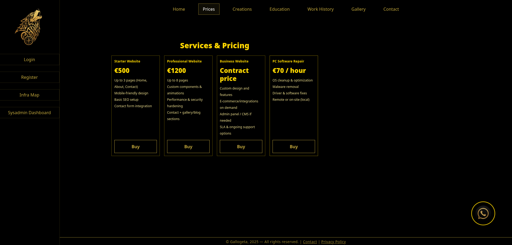

# Personal Homepage & Retro Arcade

A modern full-stack web application featuring a personal website with an integrated retro gaming arcade. Built with FastAPI, React, and EmulatorJS.

[](https://fastapi.tiangolo.com/)
[](https://reactjs.org/)

## Architecture

```
┌─────────────────────────────────────────────────────────┐
│                    Nginx Reverse Proxy                  │
│                   (Port 80/443 - SSL)                   │
└────────────────────┬────────────────────────────────────┘
                     │
        ┌────────────┴────────────┐
        │                         │
        ▼                         ▼
┌──────────────┐          ┌──────────────┐
│   Frontend   │          │   Backend    │
│  React+Vite  │◄────────►│   FastAPI    │
│  Port 3000   │   API    │  Port 8000   │
└──────────────┘  Calls   └──────┬───────┘
        │                        │
        │                        ▼
        │                ┌──────────────┐
        │                │   SQLite DB  │
        │                │  users/pages │
        │                └──────────────┘
        │
        ▼
┌──────────────────┐      ┌──────────────┐
│  EmulatorJS      │      │   ROM Files  │
│  Retro Gaming    │◄─────│  NES/GBA/etc │
└──────────────────┘      └──────────────┘
```

## Screenshots

### Desktop View


## Features

**Personal Website**
- Dynamic content management with admin panel
- User authentication with JWT and role-based access
- User management dashboard
- Real-time visitor tracking and system metrics
- Responsive mobile-first design

**Retro Gaming Arcade**
- Multi-platform emulation (NES, SNES, GBA, GB, N64, and more)
- Members-only authenticated access
- Mobile-optimized with touch controls and fullscreen
- Auto-save states via EmulatorJS
- Currently featuring 24 NES games and 10 GBA games

**Security**
- 3-tier role system (Admin, Moderator, User)
- Optional CAPTCHA support (Cloudflare Turnstile or hCaptcha)
- Email verification for user registration
- SQLite database
- Docker containerization
- Nginx reverse proxy with SSL support

## Installation

See [INSTALL.md](INSTALL.md) for comprehensive installation instructions.

### Quick Start with Docker

### Quick Start with Docker

```bash
git clone https://github.com/Gallogeta/Homepage.git
cd Homepage
docker compose up -d
```

Access at `http://localhost`

### Requirements

**For Docker Installation:**
- Docker 20.10+
- Docker Compose v2.0+

**For Manual Installation:**
- Python 3.9+
- Node.js 16+
- SQLite

### Manual Installation

**Backend:**
```bash
cd backend
python3 -m venv venv
source venv/bin/activate
pip install -r requirements.txt
uvicorn main:app --reload --host 0.0.0.0 --port 8000
```

**Frontend:**
```bash
cd frontend
npm install
npm run dev
```

## Configuration

### Backend Environment (.env)

```bash
SECRET_KEY=your-super-secret-key-change-this
DATABASE_URL=sqlite:///./data/db.sqlite3
ALLOW_ORIGINS=http://localhost:3000,http://127.0.0.1:3000

# Optional: SMTP for email
SMTP_HOST=smtp.gmail.com
SMTP_PORT=587
SMTP_USER=your-email@gmail.com
SMTP_PASS=your-app-password
MAIL_FROM=noreply@example.com
SMTP_TLS=1

# Optional: CAPTCHA
TURNSTILE_SECRET=your-cloudflare-turnstile-secret
HCAPTCHA_SECRET=your-hcaptcha-secret
```

### Frontend Environment (.env)

```bash
VITE_API_BASE=/api
VITE_SERVER_IP=192.168.0.90
```

## Project Structure

```
Homepage/
├── backend/              # FastAPI backend
│   ├── main.py          # API routes and application
│   ├── data/            # SQLite database
│   ├── SNES/            # NES/SNES ROM storage
│   └── GBA/             # GBA ROM storage
├── frontend/            # React frontend
│   ├── src/             # React components
│   └── public/          # Static assets & arcade
│       ├── arcade.html  # Retro arcade page
│       └── emulatorjs/  # EmulatorJS library
├── nginx/               # Reverse proxy config
├── docker-compose.yml   # Docker orchestration
└── start-local-dev.sh   # Local dev helper script
## Project Structure

```
Homepage/
├── backend/              # FastAPI backend
│   ├── main.py          # API routes and application
│   ├── data/            # SQLite database
│   ├── SNES/            # NES/SNES ROM storage
│   └── GBA/             # GBA ROM storage
├── frontend/            # React frontend
│   ├── src/             # React components
│   └── public/          # Static assets & arcade
├── nginx/               # Reverse proxy config
├── scripts/             # Utility scripts
├── docker-compose.yml   # Docker orchestration
├── install.sh           # Interactive installer
└── INSTALL.md           # Installation guide
```

## API Documentation

Interactive API docs available at: `http://localhost:8000/docs`

**Authentication:**
- `POST /token` - Login (returns JWT)
- `POST /api/register` - Create new account
- `GET /me` - Get current user info

**Pages:**
- `GET /api/pages/{name}` - Get page content
- `POST /api/pages/{name}` - Update page (admin only)

**Arcade:**
- `GET /api/snes` - List NES/SNES games
- `GET /api/snes/{filename}` - Download ROM (authenticated)
- `GET /api/gba` - List GBA games
- `GET /api/gba/{filename}` - Download ROM (authenticated)

## User Roles
## User Roles

| Role | Permissions |
|------|-------------|
| Admin | Full access: manage users, roles, pages, arcade, view metrics |
| Moderator | Manage users: delete and ban users |
| User | Access arcade and personal pages |

## Development

```bash
# Start local development
./start-local-dev.sh

# Docker commands
docker compose up -d          # Start all services
docker compose logs -f        # View logs
docker compose restart        # Restart services
docker compose down           # Stop all services

# Database backup
docker compose exec backend sqlite3 /app/data/db.sqlite3 .dump > backup.sql
```

## Production Deployment

1. Clone the repository on your server
2. Run the interactive installer: `sudo ./install.sh`
3. Configure SSL certificates (recommended): `sudo certbot --nginx -d yourdomain.com`
4. Access via your domain or IP address

See [INSTALL.md](INSTALL.md) for detailed deployment instructions.

## Adding Games

1. Place ROM files in `backend/SNES/` (for NES/SNES) or `backend/GBA/` (for GBA)
2. Games are automatically served with authentication
3. EmulatorJS supports: NES, SNES, GB, GBA, N64, PlayStation, Sega Genesis, and more

**Note:** This project doesn't include ROM files. You must own or have rights to any games you add.

## License

This project is licensed under the MIT License - see the LICENSE file for details.

## Acknowledgments

- [FastAPI](https://fastapi.tiangolo.com/) - Modern Python web framework
- [React](https://reactjs.org/) - Frontend library
- [EmulatorJS](https://github.com/EmulatorJS/EmulatorJS) - Retro game emulation
- [Vite](https://vitejs.dev/) - Fast frontend build tool
- [Docker](https://www.docker.com/) - Containerization platform

---

**Disclaimer:** This project is for educational purposes. Ensure you own or have the right to use any ROM files.
